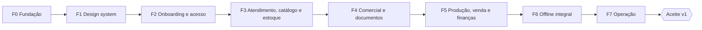

# Roadmap: Costura Pro v1

| Campo | Valor |
|---|---|
| Status | Derivado das 5 fases aprovadas pelo dono em 2026-09-15 e reorganizado em 2026-09-16 (ver [Mudanças em relação ao plano de 2026-09-15](#mudanças-em-relação-ao-plano-de-2026-09-15)) |
| Produto | [PRD.md](PRD.md) |
| Contratos | [SPEC.md](SPEC.md) (estado atual na §0) |
| Horizonte | Sem datas: projeto de um dono com agentes de IA. Cada fase só termina quando o critério de saída tem evidência |

## Premissas

- **Um desenvolvedor com agentes de IA.** Claude Code é a ferramenta padrão; Codex e clientes genéricos usam as portas geradas ([HARNESS](HARNESS.md)).
- **v1 completa só no aceite.** As fases são entregas internas; nenhuma delas é chamada de v1 ([DEC-02](PRD.md#91-produto-e-escopo)).
- **Todo agregado nasce pronto para sync.** Desde a F3, cada registro tem UUID, `version` e comandos idempotentes por `opId`, mesmo antes do espelho offline da F6. Isso evita reescrever os agregados depois.
- **Sem dados reais antes do backup.** O backup diário chega na F7. Se o dono quiser usar o sistema com dados reais antes, RF-OPE-01 a 04 sobem de fase.
- **Tunnel fechado até a F2.** Nada é exposto pela Cloudflare antes do cadastro público estar fechado no servidor.
- **Plano detalhado por fase.** No início de cada fase nasce uma spec e um plano locais (fora do git); o porquê durável vai para ADR, PRD e SPEC.

## Visão geral

A parte de servidor da F2 (schema, autenticação e contrato de sync) pode começar durante a F1; as telas da F2 esperam o design system.

### Mudanças em relação ao plano de 2026-09-15

O plano aprovado tinha 5 fases: (1) documentos, scaffold, onboarding, autenticação, dispositivos e base de sync; (2) clientes, catálogos, locais, compras, inventário e reservas; (3) orçamentos e PDFs, OS por subitem, custódia, agenda e entrega; (4) OP, acabados, venda e devolução, contas, custos e relatórios; (5) offline integral, conflitos, restauração, serviços, instaladores e atualização. Em 2026-09-16:

- entrou a F1 (design system e Storybook), no lugar dos wireframes descartados;
- a fase 5 virou F6 (offline) e F7 (operação);
- reservas foram para a F4, porque nascem na aprovação da OS;
- contas financeiras foram para a F3, porque a compra é paga numa conta ou vira obrigação;
- recebíveis e pagamentos básicos foram para a F4, porque o encerramento da OS depende do financeiro;
- a sandbox foi para a F5, porque demonstra OS, OP e venda.

| Fase | Objetivo | Critério de aceitação que fecha |
|---|---|---|
| F0 | Base executável e verificável em Windows e Ubuntu | Checks verdes e mesma origem |
| F1 | Linguagem visual e componentes antes das telas reais | Catálogo com componentes base |
| F2 | Dono único, wizard e contrato mínimo de sync | Cadastro fechado e sync idempotente provados |
| F3 | Clientes, peças recebidas, catálogo, estoque e compras | CA-03 parcial |
| F4 | Orçamento, OS, reservas, documentos e agenda | CA-02, CA-03, CA-04, CA-06 online |
| F5 | OP, venda direta, finanças, relatórios e sandbox | CA-01, CA-05 |
| F6 | Cofre, espelho, conflitos e exportação no celular | CA-06 offline, CA-07, CA-08 |
| F7 | Backup, restauração, serviços, Tunnel, instaladores e atualização | CA-09, CA-11 |
| Aceite | Todas as jornadas em todas as plataformas | CA-01 a CA-12 |

## Spikes

Cada spike responde uma pergunta que muda o desenho antes de construir em cima dela. O resultado vira decisão registrada em [REFERENCIAS](REFERENCIAS.md) e, se for de mão única, ADR.

| Spike | Pergunta | Critério de saída | Antes de |
|---|---|---|---|
| S1. PDF no navegador | Qual biblioteca gera A4 e 80 mm com fontes embutidas igual em Chrome Android, Safari iPhone e desktop? | O mesmo template gera PDF válido nas três plataformas, com acentuação correta e fonte embutida; tempo de emissão medido; bytes e hash guardados sem regeneração (resolve Q-03) | F4 |
| S2. Cofre cifrado | PBKDF2 com AES-GCM sobre Dexie é rápido o bastante num celular de referência? | Parâmetros de derivação por plataforma registrados; tempo de desbloqueio e de gravação medidos com volume de referência definido no spike; nonce e AAD cobertos por teste (resolve parte de Q-05) | F6 |
| S3. Câmera e códigos | Como ler QR e código de barras em Safari iPhone e Chrome Android? | Lê o QR da etiqueta de custódia e um EAN impresso nas duas plataformas; biblioteca escolhida; código curto digitável como alternativa (resolve Q-04) | F3 |
| S4. Retenção da PWA | Como se comportam persistência, quota e eviction na PWA instalada no iPhone e no Android? | Comportamento documentado por plataforma; exportação e importação da outbox provadas numa nova instalação (resolve parte de Q-05) | F6 |
| S5. Serviço no sistema | Como rodar o servidor Bun compilado como serviço no Windows e com `systemd` no Ubuntu? | Sobe no boot sem login, grava em ProgramData com herança cortada (só SYSTEM, Administradores e a conta do serviço) ou em `/var/lib/costura-pro` e sobrevive a reinício; wrapper escolhido entre shawl e WinSW 2.12 NET461 rodando como serviço real na sessão 0, com desligamento limpo por Ctrl+C medido contra o tempo de parada do wrapper; conta do serviço (conta virtual primeiro, LocalSystem só com motivo) gravando backup em pendrive NTFS e exFAT, pasta do OneDrive e caminho UNC; unit `systemd` gravando backup em mídia montada para o dono; porta definitiva da origem local; atalho do Edge em modo app no Windows e `.desktop` com Chrome ou Chromium no Ubuntu abrindo o acesso local (resolve parte de Q-06; a Q-11 foi resolvida pela DEC-59) | F7 |
| S6. Atualização coordenada | Um supervisor consegue trocar binários, migrar, checar saúde e reverter tudo? | Falha simulada em cada etapa volta à versão anterior com banco íntegro e nenhuma operação aceita perdida; o supervisor roda fora do processo do servidor e recusa artefato sem assinatura minisign válida (resolve parte de Q-06) | F7 |

## F0: Fundação

**Objetivo:** base executável e verificável nos dois sistemas operacionais, sem regra de negócio além das já testadas.

**Concluído:**
- Scaffold Better-T-Stack 3.43.1 (2026-09-15).
- `suggestPrice` e `planReservation` com testes (2026-09-15).
- SQLite nativo em WAL, validação de caminho local (inclusive UNC) e migrations por Bun ([ADR 0006](adr/0006-sqlite-nativo-bun.md), 2026-09-15).
- Harness de agentes com portas geradas e documentação reorganizada (2026-09-16).
- `closeDb` libera o arquivo do banco no Windows; testes de banco verdes no Windows (2026-09-16).
- pnpm 11.20.0 global e telemetria do varlock desligada: `pnpm install`, testes, `check-types` e `build` verdes no Windows (2026-09-16).
- Repositório público no GitHub com licença MIT; hooks de sessão, rules por área, skills de ciclo de entrega, índice de docs com `docs-check` e CI em Ubuntu 24.04 e Windows (2026-09-16).
- CI verde na `main` em Ubuntu 24.04 e Windows, com install a partir de clone limpo (2026-09-16).
- Ambiente Windows: `apps/server/.env` com `DATABASE_FILE` absoluto no lugar do legado `DATABASE_URL`, migrations aplicadas e servidor respondendo em localhost (2026-09-16).
- Mesma origem (2026-09-16):
  - processo único em `127.0.0.1:3000` servindo SPA, assets, `/api/auth` e `/rpc`, com teste automatizado do build real (fallback, cache, `/rpc`, `/api/auth`, denylist do service worker e tabela de sockets do sistema);
  - cliente relativo, proxy do Vite e allowlist de Host e Origin;
  - cookie `costura-pro.session_token` sem `Secure` no loopback e com `Secure` no Host canônico;
  - verificado em navegador real (dev e produção, desktop e 320 px), no `tauri dev` e no executável de release do Tauri no Windows.
- Bundle web sem aviso de chunk acima de 500 kB: devtools só em desenvolvimento e React num chunk próprio, com as rotas já divididas (2026-09-16).
- CI por caminho (2026-09-16): `harness:check`, `docs:check` e `harness:test` rodam sempre, direto no Node e sem install; install, lint, tipos, testes e build só quando o intervalo do push (de `before` ao commit, ou da base do pull request) toca algo fora de `docs/**`, `*.md` e `.claude/rules/**`, com push forçado, `before` zerado, outro evento ou falha ao listar mudanças rodando tudo (`scripts/ci-scope.mjs`).
- App Tauri removido do scaffold (Q-11, DEC-59): pasta do app, scripts e CLI do Tauri, teste do `frontendDist` (o contrato do proxy do Vite segue em `apps/server/tests/vite-proxy.test.ts`), armadilhas do HARNESS e da rule de web, papel `contract` e instruções de desenvolvimento do README (2026-09-16).

**Pendente:**
- **Build conferido numa máquina Ubuntu 24.04** além do CI (Q-10).

**Critério de saída:**
- `pnpm test`, `pnpm check-types`, `pnpm check`, `pnpm build` e `pnpm harness:check` verdes no Windows e no Ubuntu.
- Build de produção servido por um único processo em loopback, com teste automatizado de SPA fallback e das rotas `/api` e `/rpc`.
- CI verde no push da `main` em Ubuntu 24.04 e Windows.

## F1: Design system

**Objetivo:** definir a linguagem visual antes das telas reais. Os wireframes HTML foram descartados em 2026-09-16 ([DEC-52](PRD.md#97-engenharia-e-processo)).

**Entregas:**
- **Identidade "ateliê contemporâneo"** (RNF-09) desenhada com Claude Design: paleta, tipografia, espaçamento, raios, estados e 12 telas de referência em 1440 e 390 px.
- **Tokens em `packages/ui`** e componentes base:
  - texto, botão, campo, grupo de escolha, cartão e lista que vira cartão no celular;
  - navegação horizontal com grupos no desktop e barra inferior no celular;
  - badge de estado de produção, entrega e financeiro;
  - alerta, métrica, medidor, trilha de etapas, checklist e indicador de conexão e sync.
- **Catálogo `/catalogo`** só em desenvolvimento, com os estados dos componentes, no lugar do Storybook ([DEC-68](PRD.md#97-engenharia-e-processo)).

**Concluído:**
- Design system (2026-09-16), descrito em [docs/areas/design-system.md](areas/design-system.md):
  - tokens em hexadecimal com teste de contraste AA, fontes empacotadas e sem tema escuro;
  - componentes base e de navegação no `packages/ui`, com os 13 destinos agrupados por uso ([DEC-67](PRD.md#91-produto-e-escopo));
  - `apps/web` só com tokens e componentes, travado por teste contra cor solta, elemento nativo, diálogo do navegador e emoji;
  - cabeçalho, início, painel e login no desenho novo; devtools fora do build de produção;
  - verificado em navegador real em 320, 390, 768, 1024, 1280 e 1440 px, por teclado e toque, em desenvolvimento e produção.

**Pendente:**
- Documentos A4 e 80 mm e as telas de negócio seguem o Claude Design em cada fase (F3 a F7).
- Nome comercial e logo (Q-01).

**Critério de saída:**
- Catálogo roda localmente com componentes base e seus estados.
- Contraste AA e foco visível conferidos em navegador real em 320 e 1440 px.
- `apps/web` consome os tokens, sem cor ou espaçamento soltos.

## F2: Onboarding, acesso e dispositivo

**Objetivo:** substituir o login genérico do scaffold por um único dono, wizard obrigatório e o contrato mínimo de dispositivos e sync.

**Requisitos:** RF-ENT-02, 03, 05, 06; RF-ACE-01, 02, 03 (códigos de recuperação); RF-ACE-04 (aprovação de dispositivo).

**Entregas:**
- **Schema de instalação:** registro singleton da instalação, códigos de recuperação só como hash, auditoria mínima e rate limit persistido.
- **Dono único com username e senha:**
  - cadastro público rejeitado no servidor, inclusive por API direta e em tentativas concorrentes;
  - 5 tentativas por 60 s em `/sign-in/username`, persistidas;
  - cookie compatível com cada origem.
- **Wizard retomável:** identidade, conta, códigos e pasta de backup escolhida no navegador de pastas do servidor, só no acesso local, e testada; checklist de continuidade.
- **Shell de navegação** com o design system.
- **Contrato mínimo de sync:** dispositivos aprovados e revogados, operações únicas por `opId`, log de mudanças por cursor, conflito e quarentena; `push`, `pull` e `resolve` limitados à instalação e aos dispositivos.

**Concluído:**
- Servidor da F2 (2026-09-16), com testes em SQLite real e Hono autenticado:
  - instalação singleton com wizard de servidor (estados, navegador de pastas e teste de gravação da pasta de backup);
  - dono único criado só no acesso local, allowlist de rotas do Better Auth, rate limit persistido e bloqueio remoto progressivo ([ADR 0012](adr/0012-dono-unico-criado-no-acesso-local.md));
  - códigos de recuperação em hash, reset de senha só local e auditoria append-only;
  - dispositivos com segredo, aprovação direta e código de ativação, e contrato mínimo de sync com `push`, `pull`, `resolve` e `pending`, quarentena por item e resultado de cada comando gravado na transação do efeito ([ADR 0013](adr/0013-contrato-minimo-de-sincronizacao.md));
  - login web mínimo por username verificado em navegador real a 1440 e 320 px.

- Telas da F2 (2026-09-16), sobre o [design system](areas/design-system.md):
  - shell de navegação ligado às rotas, com destino sem tela aberto num estado vazio e o estado da conexão com o servidor na faixa de sub-abas ([DEC-70](PRD.md#91-produto-e-escopo));
  - wizard retomável numa tela focada, com nome, conta e login automático, códigos de recuperação baixados ou copiados com confirmação, e pasta de backup escolhida no navegador de pastas do servidor e testada ([DEC-69](PRD.md#91-produto-e-escopo));
  - Hoje, destinos, login e wizard redirecionando ao passo pendente por guardas de rota; acesso remoto antes do fim do wizard vê só o aviso de concluir no PC; `installation.status` com o acesso e `installation.details` só local ([DEC-71](PRD.md#96-plataforma-acesso-e-operação));
  - checklist de continuidade em Hoje, com os itens pendentes;
  - verificado em navegador real no build de produção com banco novo: wizard completo a 1440 px e por toque a 390 px, recarga em cada passo, 320, 390, 768, 1024 e 1440 px sem rolagem horizontal, teclado nos menus e no `Checkbox`, e acesso remoto simulado com `cf-connecting-ip`.

**Pendente:**
- Exposição do Tunnel: o critério de saída da F2 está cumprido, e a exposição depende do domínio do dono (Q-09) e do assistente de Tunnel da F7.
- Teste da pasta de backup: falha de releitura (`EACCES`) ou de remoção (`EPERM`) do arquivo de teste ainda chega à tela como erro genérico, e não como "Sem permissão de leitura"; tratar junto com o backup diário, com teste que simule a permissão negada.

**Critério de saída:**
- Testes com SQLite real provam:
  - segundo cadastro rejeitado (inclusive concorrente e por API);
  - rate limit que persiste após reinício;
  - códigos guardados só como hash;
  - dashboard bloqueado até a pasta de backup ser testada;
  - `opId` repetido devolve o mesmo resultado;
  - versão-base errada vira conflito;
  - epoch antigo vai para quarentena.
- Login e wizard verificados em navegador real no desktop e em 320 px.
- Só depois disso o Tunnel pode ser exposto (Q-09).

## F3: Atendimento, catálogo e estoque

**Objetivo:** cadastros e estoque físico com movimentos imutáveis.

**Requisitos:** RF-ATD-01 a 03, 05 a 07; RF-CAT-01 a 12; RF-EST-01 a 06, 13, 14; RF-FIN-01; RF-ENT-08; RF-ACE-14 (captura e otimização de fotos).

**Entregas:**
- Clientes, perfis, modelos de medidas, arquivamento, anonimização e recepção de peças com fotos.
- Serviços, materiais e produtos com variantes, fichas técnicas, galeria e preço sugerido.
- Locais, lotes, transferências, compras com fornecedor e conversão, rateio de frete e desconto, obrigação de compra e contas financeiras.
- Sessão de inventário, ajuste rápido e saldos de abertura.
- Etiquetas e leitura por câmera, conforme o S3.
- Busca global sobre clientes, catálogo e estoque.

**Concluído:**
- Clientes e perfis (2026-09-17), com o padrão de agregado descrito em [agregados](areas/agregados.md):
  - cliente pagador com contatos em campos fixos, busca sem acento e por trecho de telefone, e perfis de usuário da peça com nome e notas ([DEC-72 a DEC-74](PRD.md#92-atendimento-e-agenda));
  - arquivamento reversível de cliente e perfil e anonimização só no acesso local, que redige snapshots, conflitos e hash de operação ([DEC-75](PRD.md#92-atendimento-e-agenda), [ADR 0014](adr/0014-anonimizacao-redige-historico-de-sincronizacao.md));
  - cada comando definido uma vez e exposto pela procedure direta e pelo `sync.push`, com criação no registro e as quarentenas `aggregateExists` e `aggregateAnonymized` ([DEC-76](PRD.md#96-plataforma-acesso-e-operação));
  - telas em `/atendimento/clientes` (lista, novo, ficha e edição) com a sub-aba Clientes, e `Textarea`, `Dialog`, `AlertDialog` e `Monogram` no design system;
  - verificado em navegador real no build de produção com banco novo: 1440, 768, 390 e 320 px sem rolagem horizontal, por toque e teclado (foco preso no diálogo, Esc devolve o foco, menu por Enter), conflito de edição entre janelas e acesso remoto simulado sem a opção de anonimizar.
- Modelos de medidas e medições (2026-09-17), descritos em [agregados](areas/agregados.md):
  - medida em milímetros inteiros, digitada e exibida em centímetros com uma casa, e medição autocontida que copia nome, versão e rótulos do modelo ([DEC-77](PRD.md#92-atendimento-e-agenda), [DEC-79](PRD.md#92-atendimento-e-agenda), [ADR 0015](adr/0015-medidas-em-milimetros-e-medicao-autocontida.md));
  - modelos iniciais Vestido, Saia, Calça, Blusa e camisa e Blazer e paletó, semeados no boot uma única vez (Q-02 parcial, [DEC-78](PRD.md#92-atendimento-e-agenda));
  - modelos em Catálogo > Modelos de medidas, com editor que salva uma versão e campos só desativados ([DEC-80](PRD.md#92-atendimento-e-agenda)); ficha com perfis e medidas lado a lado, registrar, corrigir e histórico com diferença para a medição anterior ([DEC-81](PRD.md#92-atendimento-e-agenda));
  - anonimização zera valores e notas das medições e redige o histórico delas; toda quarentena de comando com dado pessoal guarda o hash redigido ([DEC-82](PRD.md#96-plataforma-acesso-e-operação));
  - verificado em navegador real no build de produção com banco novo: 1440, 768, 390 e 320 px sem rolagem horizontal, editor por teclado com foco seguindo o campo movido, conflito entre janelas no editor e na correção, resposta perdida seguida de nova tentativa sem duplicar, toque a 390 px e anonimização.
- Peça recebida com fotos e infraestrutura de mídia (2026-09-17), descritas em [mídia](areas/midia.md) e [agregados](areas/agregados.md):
  - peça recebida filha do cliente com estado, quantidade inteira, acessórios, observações, devolução prevista, devolução registrada e desfeita, correção e arquivamento, pelos dois caminhos ([DEC-83 a DEC-89](PRD.md#92-atendimento-e-agenda));
  - até 12 fotos de condição otimizadas no aparelho em WebP, ou JPEG onde o navegador não gera WebP, com 2048 px, miniatura de 512 px e legenda, enviadas por `PUT /api/media/<hash>` e gravadas de forma atômica ao lado do banco ([DEC-90, DEC-91](PRD.md#96-plataforma-acesso-e-operação), [ADR 0016](adr/0016-midia-enderecada-por-conteudo.md));
  - coleta de mídia sem referência com carência de 24 h, e anonimização que redige as peças e remove linhas e arquivos de mídia do cliente ([DEC-92](PRD.md#96-plataforma-acesso-e-operação));
  - painel "Peças em custódia" na ficha, páginas de receber, ver e corrigir, visualizador com Baixar e `Photo`, `PhotoTile` e `FilePickerButton` no design system;
  - verificado em navegador real no build de produção com banco novo: fotos grandes reais gravadas em WebP, reserva JPEG, HEIC, limite de 12, foto repetida, falha de envio com nova tentativa, resposta perdida sem duplicar, refetch com falha sem perder o formulário, visualizador por teclado, devolução, conflito entre janelas, 320 a 1440 px, toque em Câmera e Galeria e anonimização com as fotos respondendo 404 e os arquivos fora do disco.

- Catálogo de materiais (2026-09-17), descrito em [catálogo de materiais](areas/catalogo.md):
  - material base com categoria de texto livre com sugestões e variante com código livre, unidade base de lista fechada e imutável, precisão exibida, custo de referência, mínimo, alvo, embalagem de compra padrão e uma foto ([DEC-93 a DEC-97](PRD.md#93-catálogo-estoque-e-produção), Q-02 parcial);
  - dinheiro e quantidade em coluna inteira do SQLite por tipo próprio que devolve `bigint`, com teto validado, e inteiro em string no JSON ([DEC-98](PRD.md#96-plataforma-acesso-e-operação), [ADR 0017](adr/0017-dinheiro-e-quantidade-em-coluna-inteira.md));
  - telas em Catálogo > Materiais (lista com busca que acha por variante e código, filtro por categoria, ficha com painel de variantes, criação e edição de material e de variante), com `NumberField`, `Select` e `SuggestionField` no design system;
  - verificado em navegador real no build de produção com banco novo: material e duas variantes com unidades e precisões diferentes, foto enviada e relida, aviso de código repetido, conflito entre janelas com "Carregar versão atual", 320, 390, 768 e 1440 px sem rolagem horizontal, toque a 390 px e teclado no seletor.

- Local de estoque, lote, movimento imutável e saldo (2026-09-17), descritos em [estoque](areas/estoque.md):
  - local plano e configurável, lote opcional por variante declarado na criação e imutável como a unidade base, e movimento append-only com quantidade e valor assinados ([DEC-99 a DEC-103](PRD.md#93-catálogo-estoque-e-produção), [ADR 0018](adr/0018-movimento-append-only-com-projecao-de-saldo.md));
  - saldo numa projeção por variante, local e lote, escrita na mesma transação do movimento, com teste que compara a soma dos movimentos com a projeção;
  - saldo de abertura com quantidade e valor (custo de referência só como sugestão da tela), ajuste rápido com motivo, transferência em duas linhas ligadas e estorno que referencia o original, um por movimento, estornando as duas pernas de uma transferência;
  - telas em Estoque > Saldos e Locais, com lançamento em diálogo pela linha da variante, detalhe por local e lote, histórico com estorno, e saldo por variante na ficha do material;
  - verificado em navegador real no build de produção com banco novo: local criado pela tela, abertura com o custo sugerido (5 m a R$ 12,50 = R$ 62,50), ajuste que tira a média, transferência que conserva o total, estorno que devolve as duas pernas, variante por lote exigindo o lote, 1440, 768, 390 e 320 px sem rolagem horizontal, e teclado com foco preso no diálogo e Esc fechando.

**Pendente:**
- Sessão de inventário (RF-EST-13, parte de sessão), catálogo de serviços e produtos com variantes e ficha técnica, compras, contas financeiras, etiquetas com leitura por câmera (S3) e busca global.

**Critério de saída:**
- Parte de cadastro de estoque do CA-03 com teste de integração: variantes, local, lote, compra em embalagem, conversão e custo de aquisição com frete e desconto.
- Arquivar e anonimizar cliente, sem dado pessoal no histórico de sincronização depois de anonimizar (a recusa com trabalho ou saldo aberto fecha na F4).
- Jornadas de cadastro verificadas em navegador real no desktop e em 320 px.

## F4: Comercial, documentos e agenda

**Objetivo:** fechar a jornada cliente, orçamento, aprovação, OS, consumo, entrega e recebimento.

**Requisitos:** RF-COM-01 a 10; RF-CAT-13 a 15; RF-EST-07 a 12, 15; RF-PRO-01 a 03; RF-DOC-01 a 03, 05; RF-ATD-04, 08 a 12; RF-FIN-02, 03; RF-ENT-10.

**Entregas:**
- Orçamento com revisões, aceite parcial, desconto e alertas de margem.
- Aprovação transacional que cria OS, subitens, snapshot de medidas, reservas, pendências e recebível.
- Estados separados de produção, entrega e financeiro.
- Lista de compras consolidada.
- Consumo com lote sugerido, troca de material, reconciliação, saldo negativo com custo provisório e ajuste.
- Fluxo de produção versionado com quadro por etapa.
- Entrega parcial e liquidação de cancelamento.
- Recebíveis, pagamentos e alocação.
- Documentos PDF congelados (conforme o S1), comprovante de recepção e etiqueta de custódia.
- Agenda com compromissos, prazos, capacidade diária e mensagem preparada.
- Anonimização recusa cliente com OS ou saldo aberto; decidir com o dono como ela trata OS encerrada e documento emitido que trazem o nome do cliente, já que documento emitido é imutável ([ADR 0008](adr/0008-documentos-emitidos-imutaveis.md)) e a anonimização redige o histórico ([ADR 0014](adr/0014-anonimizacao-redige-historico-de-sincronizacao.md)).

**Critério de saída:**
- CA-02, CA-03 e CA-04 completos.
- CA-06 no desktop com conexão.
- Idempotência da aprovação provada por teste de repetição.
- Anonimizar cliente com OS aberta ou recebível em aberto é recusado, provado por teste.

## F5: Produção interna, venda direta e finanças

**Objetivo:** estoque de acabados, venda de pronto e visão financeira completa.

**Requisitos:** RF-PRO-04 a 08; RF-COM-11 a 14; RF-FIN-04 a 15; RF-ENT-04, 07, 09.

**Entregas:**
- **Produção:** OP com unidades boas, perdas, saídas parciais e custo médio por variante.
- **Venda:** venda direta, atendimento vinculado, devolução com custo congelado e exceção de sobre-venda no servidor.
- **Finanças:**
  - cartão com taxa e conta de liquidação;
  - receitas e despesas avulsas, despesas diretas, obrigações recorrentes, aporte e retirada;
  - conferência de caixa;
  - relatórios de competência e caixa em PDF.
- **Tela inicial:** Hoje completa e ações rápidas.
- **Sandbox de demonstração.**

**Critério de saída:**
- CA-01 e CA-05 completos.
- Faturamento sem dupla contagem em revisão, cancelamento e devolução, provado por teste.

## F6: Offline integral

**Objetivo:** o celular executa todos os fluxos operacionais sem internet e sincroniza sem perder nem duplicar.

**Requisitos:** RF-ACE-04 (espelho completo), 05 a 13, 14 (cache offline de imagens); RF-DOC-04; RF-COM-14 (cenário offline).

**Entregas:**
- Cofre com senha forte e PIN, espelho Dexie cifrado e outbox (conforme S2 e S4).
- Emissão de PDF e captura de fotos offline.
- Rebase e migração local.
- Caixa de conflitos, exceções e quarentena na interface.
- Exportação e importação da outbox.
- Assistente de instalação no iPhone, indicador de sync e avisos de quota.

**Critério de saída:**
- CA-06 offline, CA-07 e CA-08 completos.
- Meta de sync do RNF-05 medida num celular de referência.

## F7: Operação

**Objetivo:** instalar, proteger, restaurar e atualizar sem terminal.

**Requisitos:** RF-OPE-01 a 08; RF-ENT-01; RF-ACE-03 (resgate físico).

**Entregas:**
- **Backup e restauração:** backup diário com retenção, restauração com pré-backup e novo epoch.
- **Serviços e instaladores:** servidor e `cloudflared` como serviços (conforme S5); instalador NSIS por máquina no Windows e `.deb` no Ubuntu, com atalho que abre o acesso local no navegador.
- **Tunnel:** assistente com token do tunnel remotamente gerenciado.
- **Atualização coordenada** (conforme S6), com releases assinados em minisign no GitHub e o supervisor como único canal.
- **Diagnóstico e resgate físico.**
- **Identidade da instalação:** nome do serviço e do atalho, guarda da chave minisign e avaliação da SignPath Foundation para assinar os executáveis (Q-08).

**Critério de saída:**
- CA-09 e CA-11 completos.
- Instalação limpa em Windows e Ubuntu sem terminal.
- Restauração a partir de backup real testada.

## Aceite da v1

- CA-01 a CA-12 com evidência registrada em Windows, Ubuntu 24.04, Chrome Android e Safari iPhone.
- RNF-05 medido no PC do ateliê e num celular de referência.
- Questões em aberto do PRD resolvidas ou explicitamente adiadas pelo dono.

Só então a versão é chamada de v1.

## Rastreio de requisitos por fase

| Área | F2 | F3 | F4 | F5 | F6 | F7 |
|---|---|---|---|---|---|---|
| RF-ENT | 02, 03, 05, 06 | 08 | 10 | 04, 07, 09 | | 01 |
| RF-ATD | | 01 a 03, 05 a 07 | 04, 08 a 12 | | | |
| RF-CAT | | 01 a 12 | 13 a 15 | | | |
| RF-EST | | 01 a 06, 13, 14 | 07 a 12, 15 | | | |
| RF-PRO | | | 01 a 03 | 04 a 08 | | |
| RF-COM | | | 01 a 10 | 11 a 14 | 14 (offline) | |
| RF-DOC | | | 01 a 03, 05 | | 04 | |
| RF-FIN | | 01 | 02, 03 | 04 a 15 | | |
| RF-ACE | 01 a 03, 04 (aprovação) | 14 (captura) | | | 04 (espelho), 05 a 14 | 03 (resgate físico) |
| RF-OPE | | | | | | 01 a 08 |

## Invariantes que nunca se cortam

- Idempotência por `opId` e versão-base em todo comando que muda estado.
- Movimentos de estoque e finanças e documentos emitidos nunca são editados nem apagados.
- Dinheiro e quantidade sempre inteiros.
- Nenhuma operação confirmada é descartada; fatos concorrentes viram exceção visível.
- Cadastro público fechado antes de qualquer exposição pelo Tunnel.
- Backup com restauração testada antes de dados reais.
- Custos internos nunca aparecem ao cliente.

## Definição de pronto de cada entrega

- **Testes:** TDD para regra e comportamento novos, com testes relevantes verdes. Domínio roda em `bun test`; integração usa SQLite real em diretório temporário.
- **Checks zerados:** `pnpm check-types`, `pnpm check` e `pnpm build` sem erro nem aviso; `pnpm harness:check` quando o harness for tocado.
- **Interface:** verificada em navegador real com browser-harness, em 320 px e no desktop, por toque e teclado.
- **Migrations:**
  - só para a frente;
  - geradas por `drizzle-kit`, revisadas e aplicadas pelo executor Bun;
  - `db:push` nunca roda em dados reais.
- **Docs na mesma mudança:** PRD, SPEC (inclusive a §0), CONTEXT e ADR mudam junto quando a regra, o contrato ou o termo mudam.
- **Logs:** sem dados sensíveis.

## Dependências críticas

| Dependência | Bloqueia |
|---|---|
| F1 (design system) | Telas da F2 em diante |
| Contrato mínimo de sync da F2 | Agregados da F3 a F5 |
| S3 | Etiquetas e leitura por câmera na F3 |
| S1 | Documentos da F4 |
| S2 e S4 | Cofre e espelho da F6 |
| S5 e S6 | Instalador e atualização da F7 |
| Domínio do dono na Cloudflare (Q-09) | Uso móvel real e testes em aparelho |
| Aparelhos de validação (Q-10) | S1, S3, saída da F0 (Ubuntu), F6 e aceite |
| Repositório remoto (Q-07) | CI e releases da F7 |
